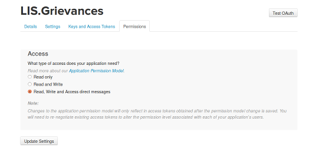

# LIS Grievances #

*Because we all need to air our grievances some time*

[Project Homepage](http://lisgrievances.com)

## V3.5 ##
- Automation is back
- `full_otherdm.py` can be added to `crontab` giving something similar to the following:

``*/30 7-21 * * * /home/grief/lis_grievances/post_grievances.py``
``*/15 7-21 * * * /home/grief/lis_grievances/full_otherdm.py``

## V3.0 ##
- Introduction of the [Grief Index](https://lisgrievances.com/grief_index.html)

## V2.5 ##
- Uses [TWURL](https://github.com/twitter/twurl) for DM interaction
- on account, checking needs to be done manually

## V2. ##
- Supports Emojis! (finally)
- Of course, there is a [patreon](https://www.patreon.com/lis_grievances)

## Setup ##

### OPTIONAL: Web files ###

- Install apache/nginx etc to display the web component
- Modify the html files to point to your account and avatar
- run `sudo ./deploy_html` to copy those files to the usual `/var/www/html`

### Next ###

- create your *_grievances* account on twitter
- be sure to add a [Mobile](https://twitter.com/settings/add_phone) number as well or you won't get an API key
- generate [Twitter API](https://apps.twitter.com/) key
- be sure to allow access to DM in APP settings (see fig 1)
- run `sudo ./install_pre` to install necessary parts (Currently just [tweepy](http://www.tweepy.org/)) and generate settings file
- create a Google Form with one text box and get a pre-filled URL, check settings for details/example
- add relevate info about form and API account info to `settings.py`
- also add path of grievance text file to `settings.py`
- create a temp directory for downloaded image files, used in media posting, set in `settings.py`

### Checking Grievances ###
- Enable TWURL in your session
- Run `full_otherdm.py` from an SSH terminal
- Will check for DMS and post to Google Form (with lots of in-between JSON manipulation, yes one day I'll fix)
- Can be added to cron as specified in V3.5 description

### Posting Grievances ###

- Your job is now to add the grievances from the spreadsheet to `hopper/grievances_to_air.txt`, or where ever else you specified.  Ie. use some discretion
- add `post_grievances.py` to crontab to fire at a reasonable time frame (once an hour on the 00s)
- once again `chmod +x` might be necessary
- There is very limited media support built in. If there is a URL to a GIF or JPG in a DM, it will post approriately, but that is pretty much it
- after a post it checks/kills any lingering DMs (like bork used to do)

### Nag Grievances ###

- You can set `nag_grievances.py` to run once a day via cron to troll for more grievances
- `chmod +x` here too
- Add your nags to the text file point to at `NAGLIST`
- Ah, I don't really use this much, at all. I suggest you don't either

### Bork Grievances ###

- Deprecated. no longer needed

**fig 1 **

An art project by [@elibtronic](https://twitter.com/elibtronic)

[elibtronic.ca](https://elibtronic.ca
